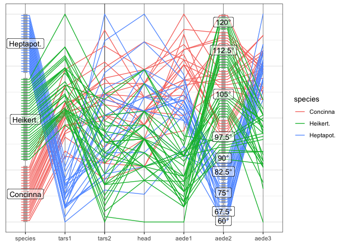
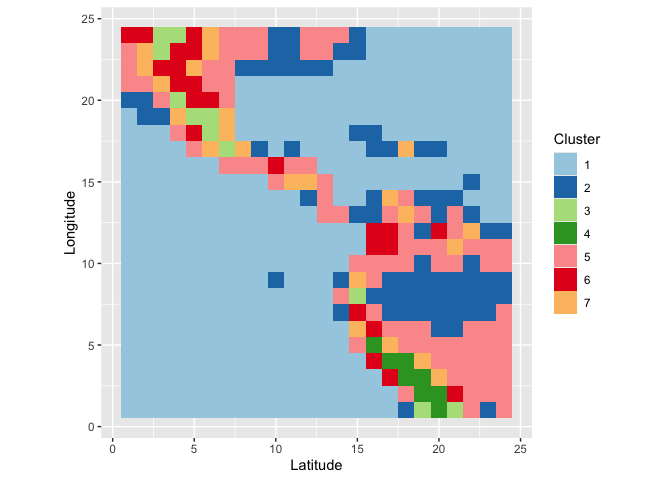
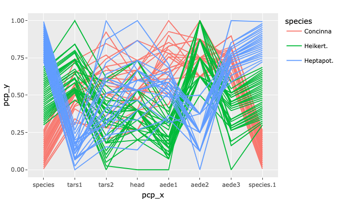

[](https://cran.r-project.org/package=ggpcp)
[](http://www.r-pkg.org/pkg/ggpcp)  
[](https://github.com/heike/ggpcp/actions)

# ggpcp

## Generalized parallel coordinate plots with ggpcp

R package for creating generalized parallel coordinate plots in the
ggplot2 framework

# Installation

`ggpcp` is available from Github:

``` r
# install.packages("devtools")
remotes::install_github("heike/ggpcp")
```

# Getting Started

Load the library

``` r
library(ggpcp)
```

Load a dataset

``` r
library(tidyverse)
data(flea, package = "GGally")
```

## A first parallel coordinate plot

Parallel coordinate plots put a number of variables side-by-side -
similar to side-by-side dotplots, and connect the dots belonging to the
same observational unit by lines.

In this implementation, we are separating the data wrangling part from
the visual rendering. Three main functions are part of the data
wrangling: data selection, data scaling, and addressing ties in
(categorical) data.

### Data manipulation

#### Data selection

`pcp_select(data, ...)` allows a selection of variables to be included
in the parallel coordinate plot. Variables can be specified by

- position, e.g. `1:4, 7, 5, 4`,
- name, e.g. `class`, `age`, `sex`, `aede1:aede3` or
- selector, e.g. `starts_with("aede")`, see
  `?tidyselect::select_helpers`

or any combination thereof. Variables can be selected multiple times and
will then be included in the data and the resulting plot multiple times.
Because variables need to be uniquely named internally, multiply
selected variables will be included in the plot with a suffix of
\<.number\>, familiar from how multiple occurrences of the same variable
names are resolved in data frames. The order in which variables are
selected determines the order in which the corresponding axis is drawn
in the parallel coordinate plots. `pcp_select` transforms the selected
variables to long form and

#### Scaling

`pcp_scale(data, method)` scales the values on each axis and determines
the relative relationship of the axes to each other.

`method` is a character string specifying the method to be used when
transforming the values of each variable into a common y axis. By
default, the method `uniminmax` is chosen, which univariately scales
each variable into a range of \[0,1\] with a minimum at 0 and the
maximum at 1. `globalminmax` maps the values across all axes into a an
interval of \[0,1\]. Except for the scale on the `y` axis, this results
a similar picture to `raw`, in which all values are left unscaled.
‘?pcp_scale’ gives more details.

#### Breaking Ties on categorical axes

`pcp_arrange(data, method, space)` provides a rescaling of values on
categorical axes to break ties. `method` is a parameter specifying which
variables to use to break ties. The two implemented functions are
`from-left` and `from-right`, meaning that ties are broken using a
hierarchical ordering using variables’ values from the left or the
right, respectively. The parameter `scale` specifies the size of the `y`
axis to be used for spacing categorical variables apart. By default, 5%
of the axis are used for spacing.

### Data Rendering

Finally, the data is piped into a call to `ggplot`. Note that the
default mappings for parallel coordinate plots are provided to the call
using `aes_pcp`. This function provides a wrapper to `ggplot2::aes` and
fills in default values for x and y axes as well as necessary meta
information, such as the type of a variable shown and orderings of
levels in factor variables.

``` r
aes_pcp()
```

    ## Aesthetic mapping: 
    ## * `x`     -> `pcp_x`
    ## * `y`     -> `pcp_y`
    ## * `yend`  -> `pcp_yend`
    ## * `class` -> `pcp_class`
    ## * `group` -> `pcp_id`
    ## * `level` -> `pcp_level`
    ## * `label` -> `pcp_level`

The geom `geom_pcp` draws line segments to connect positions of the same
observational unit across axes:

``` r
flea %>%
  pcp_select(species, 2:7, species) %>%
  pcp_scale(method="uniminmax") %>%
  pcp_arrange() %>%
  ggplot(aes_pcp()) + 
    geom_pcp_axes() + 
    geom_pcp(aes(colour = species))
```

<!-- -->

Note that the variable `species` shows up twice in the plot - once as
the rightmost variables, once as the leftmost one. `species` is a
categorical variable. `ggpcp` deals with categorical variables by using
the space on the y axis of a categorical variable to spread points out
evenly. This allows us to (a) estimate the frequency of each level, and
(b) track individual points through the parallel coordinate plot even in
the presence of categorical variables.

### The layer approach

`ggpcp` implements several geoms to work in a parallel coordinate plot
setting

- `geom_pcp` is a wrapper for the standard layer of drawing line
  segments for each observation across the specified variables
- `geom_pcp_axes` draws vertical lines at the position of each of the
  axes.
- `geom_pcp_boxes` draws rectangles framing each level of a categorical
  variable. The parameter `boxwidth` specifies the width of these
  rectangles (1 is the width between successive variables). `boxwidth`
  is set to 0.2 by default.
- `geom_pcp_labels` places a label center on each rectangle of a
  categorical variable. XXX The familiar parameters `nudge_x` and
  `nudge_y` work as usual to move labels. XXX HH: need to check that
  that’s true

``` r
flea %>%
  pcp_select(1:7) %>%
  pcp_scale(method="uniminmax") %>%
  pcp_arrange() %>%
  ggplot(aes_pcp()) + 
    geom_pcp_axes() + 
    geom_pcp_boxes(boxwidth = 0.1, fill="grey70") +
    geom_pcp(aes(colour = species), overplot = "none") +
    geom_pcp_labels() 
```

<!-- -->

## Examples

### Another look at the Titanic Data

For categorical variables `ggpcp` presents a result similar to parsets
by Kosara et al (2013).

``` r
titanic <- as.data.frame(Titanic)
titanic <- titanic %>%
  purrr::map(.f = function(x) rep(x, titanic$Freq)) %>%
  as.data.frame() %>% select(-Freq)


titanic %>% 
  pcp_select(1:4) %>%
  pcp_scale() %>%
  pcp_arrange(method="from-right") %>%
  ggplot(aes_pcp()) + 
    geom_pcp_boxes(boxwidth=0.1) + 
    geom_pcp(aes(colour = Survived), alpha = 0.1, axiswidth = c(0,0)) +
    scale_colour_manual(values=c("darkorange", "steelblue")) +
    guides(colour=guide_legend(override.aes = list(alpha=1))) +
    geom_pcp_labels() +
    scale_x_discrete(expand = expansion(add=0.2))
```

<!-- -->

Switching the ordering method in `pcp_arrange` to `from-both` allows us
to focus on the two-dimensional relationships between variables on
adjacent axes:

``` r
titanic %>% 
  pcp_select(1:4) %>%
  pcp_scale() %>%
  pcp_arrange(method="from-both") %>%
  ggplot(aes_pcp()) + 
    geom_pcp_boxes(boxwidth=0.1) + 
    geom_pcp(aes(colour = Survived), alpha = 0.1) +
    scale_colour_manual(values=c("darkorange", "steelblue")) +
    guides(colour=guide_legend(override.aes = list(alpha=1))) +
    geom_pcp_labels() +
    scale_x_discrete(expand = expansion(add=0.2))
```

    ## Scale for x is already present.
    ## Adding another scale for x, which will replace the existing scale.

<!-- -->

Note that now the observations within each variable level are resorted
before line segments are connected to adjacent axes. This allows us to
keep track of individual observations throughout the parallel coordinate
plot even in the presence of thousands of observations as in the example
of persons on board the Titanic.

### Mixed data: categorical and numeric variables

while the `mtcars` data is quite old, it serves a good purpose here. All
of the variables are coded as numeric variables, even when they should,
in fact, be factor variables. In a standard parallel coordinate plot we
get the usual uninformative fishnet between categorical variables such
as `vs`, `am`, and `gear`, also visible for variable `cyl`:

``` r
mtcars %>%
  pcp_select(1:ncol(mtcars)) %>%
  pcp_scale() %>%
  ggplot(aes_pcp()) + 
    geom_pcp_axes() + 
    geom_pcp(aes(colour = as.numeric(mpg)))
```

<!-- -->

Once the variables are coded properly as factor variables, we get a much
more informative view with a generalized parallel coordinate plot:
Additionally, we draw separate facets for cars with higher and lower
mileage (above 20 mpg versus below 20 mpg).

``` r
mtcars %>%
  mutate(cyl = factor(cyl),
         vs = factor(vs),
         am = factor(am),
         gear=factor(gear),
         carb = factor(carb),
         `liter/100km` = 1/(mpg*1.6/4),
         `-disp` = -disp) %>%
  arrange(mpg) %>% # draw lines from lowest to highest mileage
  pcp_select(1,12, 2:11,13) %>%
  pcp_scale() %>%
  pcp_arrange(method="from-left") %>%
  ggplot(aes_pcp()) + 
    geom_pcp_axes() + 
    geom_pcp_boxes(fill="grey80") + 
    geom_pcp(aes(colour = as.numeric(mpg)), size = 1, overplot = "none") +
  scale_colour_gradient2("mpg", mid="grey80", midpoint = 20, low="darkred", high="darkblue") +
  theme_bw() + 
  facet_grid(mpg>20~., labeller = "label_both")
```

<!-- -->

What becomes obvious in this plot, is that fuel consumption of each car
measured in miles per gallons (mpg), encoded as the first variable in
the plot and as color of the lines - is correlated strongly with all of
the variables, not just the numeric variables. A large number of
cylinders (cyl), a V-shaped engine (vs = 0), an automatic transmission
(am = 0), a low number of forward gears and a high number of carburetors
are related to a low value of mpg (red lines).

Note: the order in which line segments are drawn depends on the order in
which observations are listed in the data set. In the previous example,
lines are ordered by the corresponding mileage from lowest to highest.
Line segments of cars with the lowest mileage are drawn first (in darker
shades of red), lines for cars with higher mileage are drawn
subsequently. The car with the highest mileage is drawn in dark blue at
the top.

### Bigger Example

One application for generalized parallel coordinate plots is their use
for visualizing clusters.

``` r
data(nasa, package="ggpcp")
```

The `nasa` data, made available as part of the `ggpcp` package provides
and extension to the data provided in the `GGally` package, was used in
the 2006 ASA Expo. It consists of monthly measurements of several
climate variables, such as cloud coverage, temperature, pressure, and
ozone values, captured on a 24x24 grid across Central America between
1995 and 2000.

We grouped locations using all January and July measurements of all
climate variables using a hierarchical clustering based on Ward’s
distance. The resulting clusters can then be summarized visually. What
we see is that the clusters have a very distinct geographic pattern
(tile plot).

``` r
wide %>% separate(id, into=c("y", "x"), remove = FALSE) %>%
  mutate(x = as.numeric(x), y = as.numeric(y)) %>%
  ggplot(aes(x = x, y=y, fill=factor(cl7))) +
  geom_tile() + scale_fill_brewer("Cluster", palette = "Paired") +
  xlab("Latitude") + ylab("Longitude") +
  coord_equal()
```

<!-- -->

<!-- From the parallel coordinate plot we see that cloud coverage in low, medium and high altitude distinguishes quite succinctly between some of the clusters. (Relative) temperatures in January (1) and July (7) are very indicative to separate between clusters on the Southern and Northern hemisphere.  -->

<!-- ```{r} -->

<!-- wide %>% -->

<!--   ggplot(aes(vars=vars(95:108))) + -->

<!--   geom_pcp(aes(colour=factor(cl7))) + facet_wrap(~cl7) + -->

<!--   coord_flip() + scale_colour_brewer("Cluster", palette = "Paired") -->

<!-- ``` -->

#### Visualizing the cluster process

A regular parallel coordinate plot allows us to visualize a part of the
dendrogram corresponding to the hierarchical clustering.

``` r
wide %>%
  pcp_select(86:94) %>%
  pcp_scale() %>%
  ggplot(aes_pcp()) + 
    geom_pcp_axes() + 
    geom_pcp() +
  xlab("Number of clusters")
```

<!-- -->

Using the generalized parallel coordinate plots we can visualize the
clustering process in plots similar to what Schonlau (2002, 2004) coined
the clustergram:

``` r
wide <- wide %>%
  mutate(
    cl2 = factor(cl2),
    cl3 = factor(cl3),
    cl4 = factor(cl4),
    cl5 = factor(cl5),
    cl6 = factor(cl6),
    cl7 = factor(cl7),
    cl8 = factor(cl8),
    cl9 = factor(cl9),
    cl10 = factor(cl10)
  ) 

wide %>%
    pcp_select(86:94) %>%
  pcp_scale() %>%
  pcp_arrange() %>%
  ggplot(aes_pcp()) + 
  geom_pcp_boxes(boxwidth=0.1) +
  geom_pcp(aes(colour = cl10), alpha = 0.25) +
  xlab("Number of clusters") +
  scale_colour_brewer("Cluster", palette="Paired") +
  guides(colour=guide_legend(override.aes = list(alpha=1)), reverse = TRUE)
```

<!-- -->

Along the x-axis the number of clusters are plotted with one pcp axis
each, from two clusters (left) to 10 clusters (right most pcp axis).
Each observation is drawn as a multi-segmented line and colored by its
assignment in the ten-cluster solution. This gives an excerpt of the
dendrogram that allows an assessment of the number of observations in
each cluster as well as the relationship between successive clustering
steps.

# Related work

Parallel coordinate plots have been implemented in analysis software
since the mid 1980s (Inselberg 1985, Wegman 1990). Several packages in R
are dedicated to visualizing parallel coordinate plots.

Using base plots the main function for drawing parallel coordinate plots
is `parcoord` implemented in MASS (Venables and Ripley 2004). The
package `gclus` (Hurley 2019) implements `cparcoord` to include panel
color as a representation of the strength of a correlation between
neighboring axes.

Within the ggplot2 environment there are several packages implementing
parallel coordinate plots. For numeric variables there’s the function
`ggparcoord` from the `GGally` package, for categorical variables the
`ggparallel` package provides an implementation of PCP-like plots, such
as the Hammock plot (Schonlau 2003) and parsets (Kosara et al, 2013).

The
[bigPint](https://github.com/rstats-gsoc/gsoc2017/wiki/bigPint%3A-Big-multivariate-data-plotted-interactively)
Google Summer of Code project 2017 implemented static and interactive
versions of parallel coordinate plots within the framework of plotting
large data interactively. These functions are meant for exploration and
discovery and are not fully parameterized for their appearance.

## Motivation for the Re-implementation

As can be seen from the examples above, there are a lot of approaches to
parallel coordinate plots, so why do we need another implementation?

All of the implementations described above have in common that they
describe highly specialized plots - in the sense that there are tens of
parameters describing construction, type, and appearance of the plot.
While giving the user some flexibility this way, this approach goes
against the modular approach of the tidyverse, and in particular against
the layered approach of ggplot2, i.e. at best the approaches make use of
ggplot2, but they do not make use of the ideas behind ggplot2.

The main idea of `ggpcp` is that we separate the data transformations
from the visualization, i.e. rather than working with a single function
to draw a plot, we are providing a set of functions that work together.

This idea is not new - a function under the very same name was at some
point part of ggplot2 (see
<https://www.rdocumentation.org/packages/ggplot2/versions/0.9.2.1/topics/ggpcp>),
but at the time the implementation stalled and was eventually removed
from ggplot2.

## References

- Hofmann H., Vendettuoli M.: Common Angle Plots as Perception-True
  Visualizations of Categorical Associations, IEEE Transactions on
  Visualization and Computer Graphics, 19(12), 2297-2305, 2013.
- Hurley C.: gclus: Clustering Graphics. R package version 1.3.2.
  <https://CRAN.R-project.org/package=gclus>
- Inselberg A., The Plane with Parallel Coordinates, The Visual
  Computer, 1(2), 69-91, 1985.
- Kosara R., Bendix F., Hauser H., Parallel Sets: Interactive
  Exploration and Visual Analysis of Categorical Data, IEEE Transactions
  on Visualization and Computer Graphics, 12(4), 558-568, 2006.
- Schloerke B., Crowley J., Cook D., Briatte F., Marbach M., Thoen E.,
  Elberg ., Larmarange J.: GGally: Extension to ‘ggplot2’, R package
  version 1.4.0.
- Schonlau M.: Visualizing Categorical Data Arising in the Health
  Sciences Using Hammock Plots, Proc. of Section on Statistical Graphics
  ASA, 2003.
- Schonlau M. The clustergram: a graph for visualizing hierarchical and
  non-hierarchical cluster analyses. The Stata Journal, 2002; 2
  (4):391-402.
- Schonlau M. Visualizing Hierarchical and Non-Hierarchical Cluster
  Analyses with Clustergrams. Computational Statistics: 2004;
  19(1):95-111.
- Venables W.N., Ripley B.D.: Modern Applied Statistics with S (4th ed),
  Springer, 2002.
- Wegman, E., Hyperdimensional Data Analysis Using Parallel Coordinates,
  JASA, 85(411), 664-675, 1990.
- Wickham H., ggplot2: Elegant graphics for data analysis (2nd ed),
  Springer, 2016
- Wickham H., Tidy data. The Journal of Statistical Software, 59, 2014.
- Wilkinson L., The Grammar of Graphics. Statistics and Computing,
  Springer, 1999.
